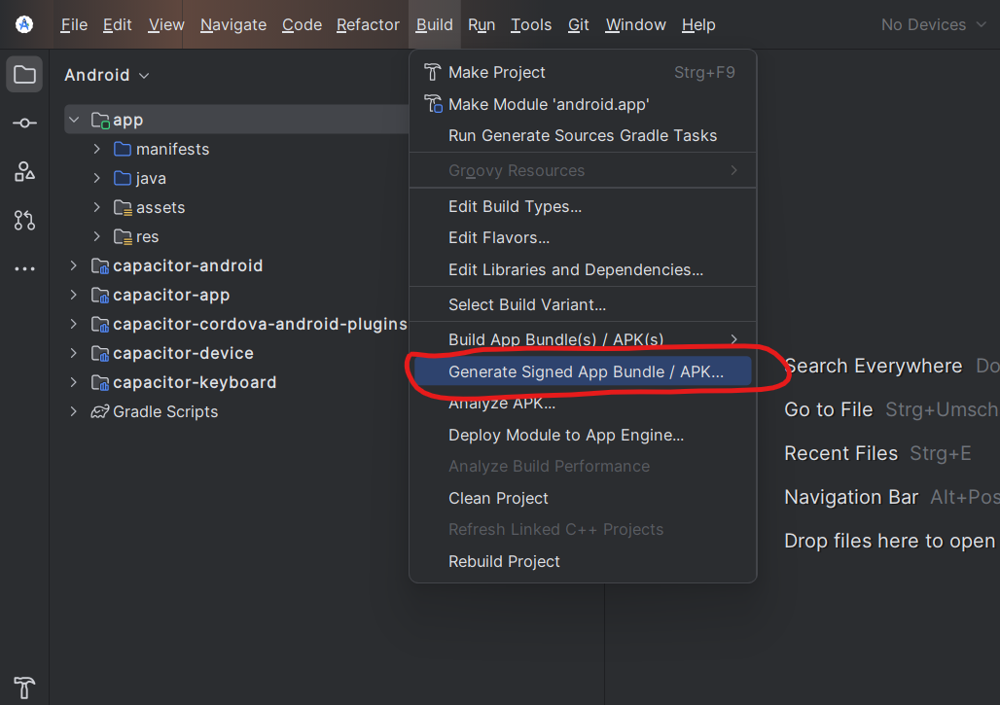
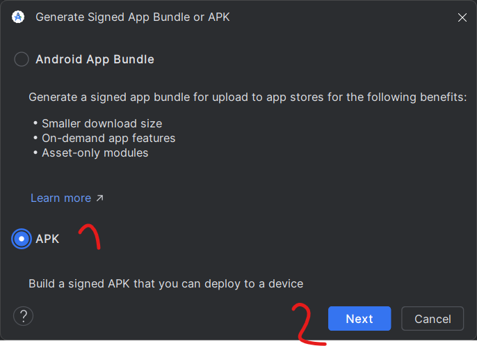
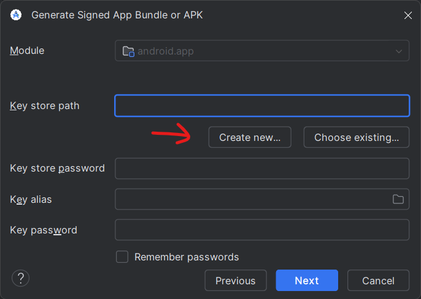
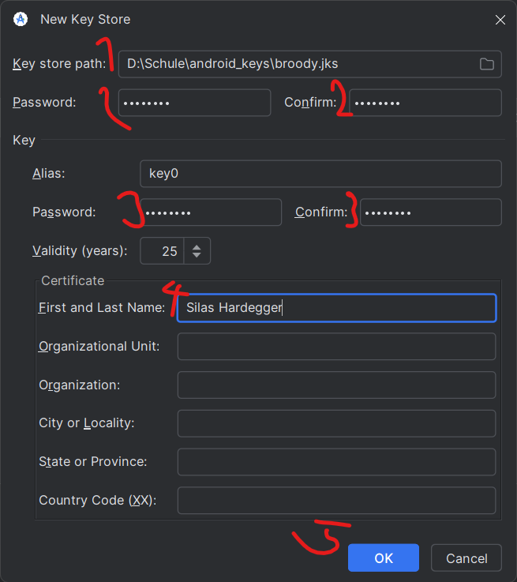
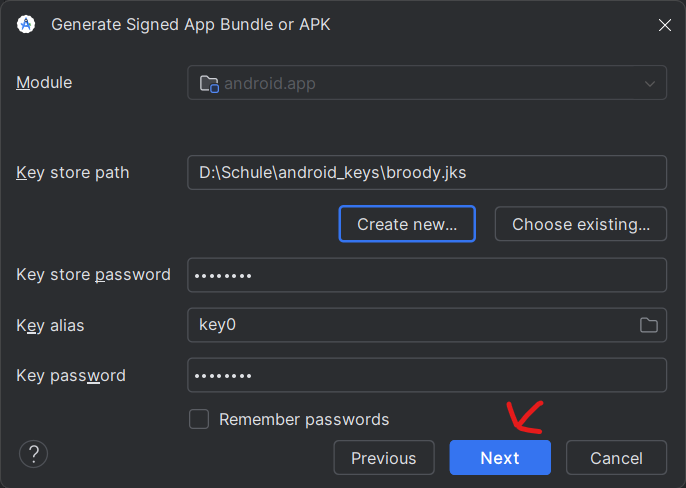
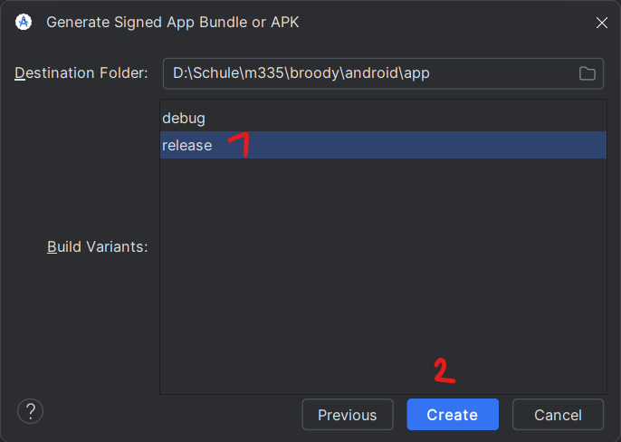
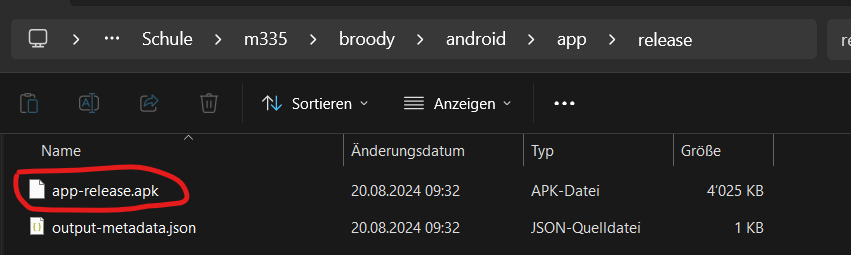

# Release

1. **Setup project**: [README](../README.md#setup)
2. **Generate files for android**: ```ionic cap sync```
3. **Open Android Studio**: ```ionic cap open android```
4. **Generate APK**:
   1. Select Build > Generate Signed App Bundle / APK
      
   2. Select APK and continue
      
   3. Create a new key store
      
   4. Select a path, a store password, a key password, enter your name and continue
      
   5. Check data and continue
      
   6. Select release and continue (change the output path if necessary)
      
   7. Your APK is located in the path specified in vi
      
